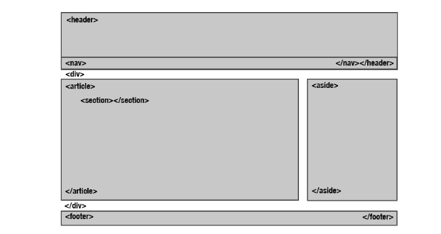

# Web Studies

Simple repo for understanding the basic Web elements.

## HTML

- `<!DOCTYPE html>`: Declare the document type;
- `<html lang="pt-br">`: Open html tag specifing the pt-br language for the page;
- `<head>`: Tag for page configuration (meta, title, etc);
- `<meta charset="utf8">`: Sets UTF8 as the default charset of the page;
- `
`: Starts a paragraph with spaces among them;
- `<b>`: Bold text;
- `<i>`: Italic text;
- `<u>`: Underlined text;
- ``: Subscribed text;
- ``: Superscript text;
- `<big>`: Bigger text than default font;
- `<small>`: Smaller text than default font;
- `<em>`: Italic text;
- `<strong>`: Bold text;
- ` `: Break the line;

Structure tags:

